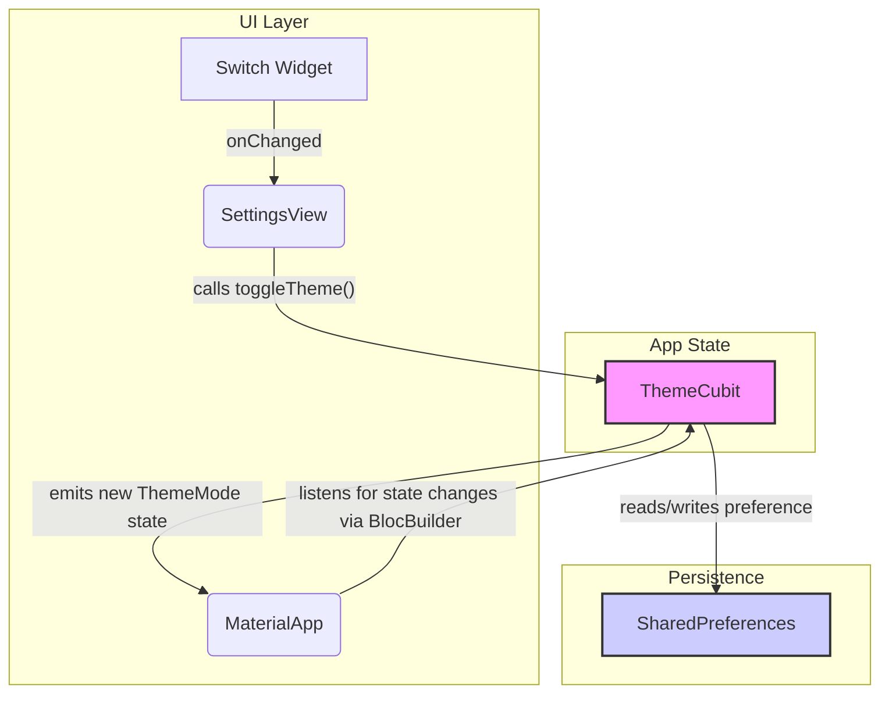

# Dark Mode and Theme Toggle Design Document (Cubit)

## 1. Overview

This document outlines the design for implementing a dark mode feature in the application. The goal is to allow users to manually switch between a light and a dark theme. The user's preference will be persisted across app sessions. This will be achieved by creating a theme management service using `Cubit`, defining a dark theme based on the existing color scheme, and adding a UI control for the user to toggle the theme.

## 2. Detailed Analysis

The application currently has a light theme but lacks a dark theme and the functionality for a user to switch between modes. Implementing this feature requires three main components:

1.  **State Management:** A mechanism is needed to manage the currently selected `ThemeMode` and notify the application when it changes. Per the user's request, `Cubit` (from the `flutter_bloc` package) will be used. A `ThemeCubit` will manage the `ThemeMode` state.
2.  **Theme Persistence:** To provide a good user experience, the selected theme must be saved on the device. `shared_preferences` is the standard and recommended way to store simple key-value data, making it perfect for this use case.
3.  **UI/UX:**
    *   A `darkTheme` `ThemeData` object needs to be defined. This will be generated from the existing `ColorScheme.fromSeed()` to ensure visual consistency.
    *   The `MaterialApp` widget must be configured to use the new `darkTheme` and to listen for state changes from the `ThemeCubit`.
    *   A UI control, such as a `Switch`, must be added to allow the user to change the theme. A new settings screen will be created to host this toggle.

## 3. Alternatives Considered

| Strategy | Pros | Cons | Decision |
| :--- | :--- | :--- | :--- |
| **`ChangeNotifier` + `Provider`** | Simple, built-in to Flutter (via `foundation`), easy to understand. | Less structured than BLoC for larger projects. | Rejected per user request. |
| **BLoC/Cubit** | Powerful, scalable, good separation of concerns, great testability. | Can be more verbose than Provider for simple cases. | **Chosen**. Explicitly requested by the user. |
| **Riverpod** | Compile-safe, flexible, powerful. | Introduces another third-party dependency; can have a steeper learning curve. | Rejected. |

## 4. Detailed Design

### 4.1. Dependencies

The following packages will be added to `pubspec.yaml`:

*   `flutter_bloc`: For state management with Cubit.
*   `shared_preferences`: For persisting the theme setting.

### 4.2. State Management: `ThemeCubit`

A new file, `lib/core/utils/theme/theme_cubit.dart`, will be created.

```dart
import 'package:flutter/material.dart';
import 'package:flutter_bloc/flutter_bloc.dart';
import 'package:shared_preferences/shared_preferences.dart';

class ThemeCubit extends Cubit<ThemeMode> {
  final String key = "theme";
  SharedPreferences? _prefs;

  ThemeCubit() : super(ThemeMode.light) {
    _loadFromPrefs();
  }

  _initPrefs() async {
    _prefs ??= await SharedPreferences.getInstance();
  }

  _loadFromPrefs() async {
    await _initPrefs();
    String? theme = _prefs!.getString(key);
    if (theme == 'dark') {
      emit(ThemeMode.dark);
    } else {
      emit(ThemeMode.light);
    }
  }

  _saveToPrefs(String theme) async {
    await _initPrefs();
    _prefs!.setString(key, theme);
  }

  void toggleTheme() {
    if (state == ThemeMode.light) {
      _saveToPrefs('dark');
      emit(ThemeMode.dark);
    } else {
      _saveToPrefs('light');
      emit(ThemeMode.light);
    }
  }
}
```

### 4.3. Main Application Entrypoint (`main.dart`)

The `main.dart` file will be updated to:
1.  Wrap the root widget with `BlocProvider`.
2.  Wrap `MaterialApp` in a `BlocBuilder` to react to state changes.
3.  Define `theme` and `darkTheme` properties for `MaterialApp`.

```dart
// lib/main.dart (snippet)
import 'package:flutter/material.dart';
import 'package:flutter_bloc/flutter_bloc.dart';
import 'core/utils/theme/theme_cubit.dart';
import 'features/checkout/presentation/views/cart_veiw.dart'; // Assuming this is the home view

void main() {
  runApp(const PaymentApp());
}

class PaymentApp extends StatelessWidget {
  const PaymentApp({super.key});

  @override
  Widget build(BuildContext context) {
    return BlocProvider(
      create: (context) => ThemeCubit(),
      child: BlocBuilder<ThemeCubit, ThemeMode>(
        builder: (context, themeMode) {
          return MaterialApp(
            debugShowCheckedModeBanner: false,
            theme: ThemeData(
              colorScheme: ColorScheme.fromSeed(
                seedColor: Colors.blue, // Example seed color
                brightness: Brightness.light,
              ),
              // Other light theme properties...
            ),
            darkTheme: ThemeData(
              colorScheme: ColorScheme.fromSeed(
                seedColor: Colors.blue, // Same seed color
                brightness: Brightness.dark,
              ),
              // Other dark theme properties...
            ),
            themeMode: themeMode,
            home: const CartView(),
          );
        },
      ),
    );
  }
}
```

### 4.4. UI: Settings Screen and Toggle

A new view, `lib/features/settings/presentation/views/settings_view.dart`, will be created to host the theme toggle.

```dart
// lib/features/settings/presentation/views/settings_view.dart
import 'package:flutter/material.dart';
import 'package:flutter_bloc/flutter_bloc.dart';
import '../../../core/utils/theme/theme_cubit.dart';

class SettingsView extends StatelessWidget {
  const SettingsView({super.key});

  @override
  Widget build(BuildContext context) {
    return Scaffold(
      appBar: AppBar(
        title: const Text('Settings'),
      ),
      body: BlocBuilder<ThemeCubit, ThemeMode>(
        builder: (context, state) {
          return ListView(
            children: [
              ListTile(
                title: const Text('Dark Mode'),
                trailing: Switch(
                  value: state == ThemeMode.dark,
                  onChanged: (val) {
                    context.read<ThemeCubit>().toggleTheme();
                  },
                ),
              ),
            ],
          );
        },
      ),
    );
  }
}
```
A navigation element will be added to `custom_app_bar.dart` to navigate to this new settings screen.

### 4.5. System Diagram

Here is a diagram illustrating the flow of theme state with Cubit:



## 5. Summary

The proposed design introduces a `ThemeCubit` to manage the app's theme state (`ThemeMode`), which is persisted using `shared_preferences`. The `MaterialApp` is wrapped in a `BlocBuilder` to react to theme changes. A new settings screen will be created containing a `Switch` to allow the user to toggle between themes. This approach uses the user-preferred `Cubit` state management library and follows modern Flutter best practices.

## 6. References

*   [BLoC Library](https://bloclibrary.dev/)
*   [SharedPreferences Package](https://pub.dev/packages/shared_preferences)
*   [Flutter Docs: Theming](https://docs.flutter.dev/cookbook/design/themes)
